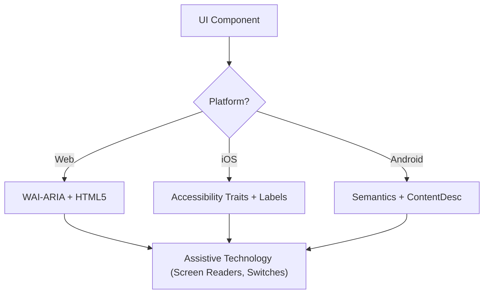

# アクセシビリティ (WCAG 2.2)

スクリーンリーダー、スイッチコントロール、キーボード操作を使うすべてのユーザーにとって、デジタルインターフェースが Perceivable（知覚可能）、Operable（操作可能）、Understandable（理解可能）、Robust（堅牢）（POUR）であることを保証する。WCAG 2.2 達成基準の技術的実装に焦点を当てる。プラットフォーム別の具体実装は `references/` 配下を参照する。

## 起動タイミング

- Web、iOS、Android 向けの UI コンポーネント仕様を定義するとき
- 既存コードのアクセシビリティ障壁や準拠ギャップを監査するとき
- Target Size (Minimum) や Focus Appearance などの新しい WCAG 2.2 標準を実装するとき
- 高レベルなデザイン要件を技術属性（ARIA ロール、特性、ヒント）にマッピングするとき

## コアコンセプト

- **POUR 原則**: WCAG の基盤（Perceivable、Operable、Understandable、Robust）
- **セマンティックマッピング**: 汎用コンテナよりもネイティブ要素を使い、組み込みのアクセシビリティを得る
- **アクセシビリティツリー**: 支援技術が実際に「読み取る」UI の表現
- **フォーカス管理**: キーボード／スクリーンリーダーのカーソル順序と可視性を制御する
- **ラベリングとヒント**: `aria-label`、`accessibilityLabel`、`contentDescription` を通じてコンテキストを提供する

## POUR の実装ステップ

### Step 1: コンポーネントロールを特定する

機能的な目的を判断する（ボタン、リンク、タブ、ダイアログ等）。カスタムロールに頼る前に、可能な限り最もセマンティックなネイティブ要素を使う。

### Step 2: 知覚可能な属性を定義する

- テキストコントラスト **4.5:1**（通常）または **3:1**（大文字 / UI）
- 非テキストコンテンツ（画像、アイコン）にテキスト代替を追加
- レスポンシブな再フロー（機能を失わずに最大 400% ズーム）

### Step 3: 操作可能なコントロールを実装する

- 最小 **24×24 CSS ピクセル**（WCAG 2.2 SC 2.5.8）。ネイティブは慣行的に 44×44 pt / 48×48 dp
- すべてのインタラクティブ要素がキーボードで到達可能で、可視のフォーカスインジケーターを持つ（SC 2.4.11）
- ドラッグ動作にシングルポインター代替を提供

### Step 4: 理解可能なロジックを保証する

- 一貫したナビゲーションパターン
- 説明的なエラーメッセージと修正提案（SC 3.3.3）
- 「冗長な入力」を避ける（SC 3.3.7）

### Step 5: 堅牢な互換性を検証する

- 正しい `Name, Role, Value` パターン
- 動的ステータスの告知に `aria-live` / live region を実装

## アーキテクチャ図

## クロスプラットフォームマッピング

| 機能 | Web (HTML/ARIA) | iOS (SwiftUI) | Android (Compose) |
|---|---|---|---|
| **主要ラベル** | `aria-label` / `<label>` | `.accessibilityLabel()` | `contentDescription` |
| **補助ヒント** | `aria-describedby` | `.accessibilityHint()` | `Modifier.semantics { stateDescription = ... }` |
| **アクションロール** | `role="button"` | `.accessibilityAddTraits(.isButton)` | `Modifier.semantics { role = Role.Button }` |
| **ライブ更新** | `aria-live="polite"` | `.accessibilityLiveRegion(.polite)` | `Modifier.semantics { liveRegion = LiveRegionMode.Polite }` |

## プラットフォーム別の詳細

| プラットフォーム | ファイル |
|---|---|
| Web (HTML / WAI-ARIA) | `references/web.md` |
| iOS (SwiftUI) | `references/ios.md` |
| Android (Jetpack Compose) | `references/android.md` |

## 避けるべきアンチパターン

- **Div ボタン**: ロールやキーボードサポートを追加せずに `
` や `` をクリックイベントに使う
- **色のみによる意味伝達**: エラーや状態を色の変化のみで示す（例: 枠線を赤に変える）
- **モーダルのフォーカス未トラップ**: フォーカスをトラップしないモーダル。フォーカスは _トラップされ_、`Escape` キーまたは閉じるボタンで _脱出可能_ でなければならない（WCAG SC 2.1.2）
- **冗長な alt テキスト**: 「Image of...」「Picture of...」を使う（スクリーンリーダーは既にロール「Image」を読み上げる）

## ベストプラクティスチェックリスト

- [ ] インタラクティブ要素が **24×24px**（Web）または **44×44pt** / **48×48dp**（ネイティブ）のターゲットサイズを満たす
- [ ] フォーカスインジケーターが明確に視認でき、高コントラスト
- [ ] モーダルが開いている間はフォーカスを **トラップ**、`Escape` キーまたは閉じるボタンで適切に解放
- [ ] ドロップダウンとメニューが閉じるときにトリガー要素にフォーカスを戻す
- [ ] フォームがテキストベースのエラー提案を提供
- [ ] アイコンのみのボタンすべてに説明的なテキストラベル
- [ ] テキストがスケールされたときにコンテンツが適切に再フロー
