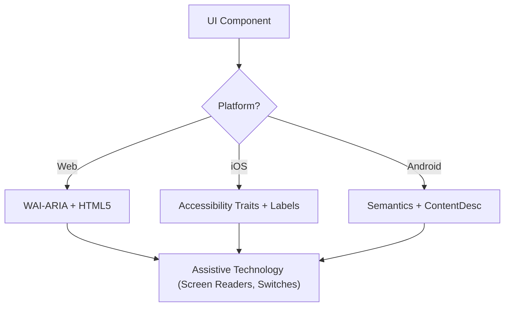

# アクセシビリティ (WCAG 2.2)

このスキルは、スクリーンリーダー、スイッチコントロール、キーボード操作を使用するユーザーを含むすべてのユーザーにとって、デジタルインターフェースが Perceivable（知覚可能）、Operable（操作可能）、Understandable（理解可能）、Robust（堅牢）（POUR）であることを保証する。WCAG 2.2 達成基準の技術的実装に焦点を当てる。

## 起動タイミング

- Web、iOS、Android 向けの UI コンポーネント仕様を定義するとき。
- 既存コードのアクセシビリティ障壁や準拠ギャップを監査するとき。
- Target Size (Minimum) や Focus Appearance などの新しい WCAG 2.2 標準を実装するとき。
- 高レベルなデザイン要件を技術属性（ARIA ロール、特性、ヒント）にマッピングするとき。

## コアコンセプト

- **POUR 原則**: WCAG の基盤（Perceivable、Operable、Understandable、Robust）。
- **セマンティックマッピング**: 汎用コンテナよりもネイティブ要素を使用し、組み込みのアクセシビリティを提供する。
- **アクセシビリティツリー**: 支援技術が実際に「読み取る」UI の表現。
- **フォーカス管理**: キーボード／スクリーンリーダーのカーソルの順序と可視性を制御する。
- **ラベリングとヒント**: `aria-label`、`accessibilityLabel`、`contentDescription` を通じてコンテキストを提供する。

## 動作原理

### Step 1: コンポーネントロールを特定する

機能的な目的を判断する（例：これはボタンか、リンクか、タブか？）。カスタムロールに頼る前に、可能な限り最もセマンティックなネイティブ要素を使用する。

### Step 2: 知覚可能な属性を定義する

- テキストコントラストが **4.5:1**（通常）または **3:1**（大文字/UI）を満たすことを保証する。
- 非テキストコンテンツ（画像、アイコン）にテキスト代替を追加する。
- レスポンシブな再フロー（機能を失わずに最大 400% ズーム）を実装する。

### Step 3: 操作可能なコントロールを実装する

- 最小 **24x24 CSS ピクセル** のターゲットサイズを保証する（WCAG 2.2 SC 2.5.8）。
- すべてのインタラクティブ要素がキーボードで到達可能で、可視のフォーカスインジケーターを持つことを検証する（SC 2.4.11）。
- ドラッグ動作にシングルポインター代替を提供する。

### Step 4: 理解可能なロジックを保証する

- 一貫したナビゲーションパターンを使用する。
- 説明的なエラーメッセージと修正提案を提供する（SC 3.3.3）。
- 同じデータを 2 回求めないように「冗長な入力」（SC 3.3.7）を実装する。

### Step 5: 堅牢な互換性を検証する

- 正しい `Name, Role, Value` パターンを使用する。
- 動的なステータス更新には `aria-live` またはライブリージョンを実装する。

## アクセシビリティアーキテクチャ図



## クロスプラットフォームマッピング

| 機能              | Web (HTML/ARIA)          | iOS (SwiftUI)                        | Android (Compose)                                           |
| :----------------- | :----------------------- | :----------------------------------- | :---------------------------------------------------------- |
| **主要ラベル**     | `aria-label` / `<label>` | `.accessibilityLabel()`              | `contentDescription`                                        |
| **補助ヒント**     | `aria-describedby`       | `.accessibilityHint()`               | `Modifier.semantics { stateDescription = ... }`             |
| **アクションロール** | `role="button"`          | `.accessibilityAddTraits(.isButton)` | `Modifier.semantics { role = Role.Button }`                 |
| **ライブ更新**     | `aria-live="polite"`     | `.accessibilityLiveRegion(.polite)`  | `Modifier.semantics { liveRegion = LiveRegionMode.Polite }` |

## 例

### Web: アクセシブルな検索

```html
<form role="search">
  <label for="search-input" class="sr-only">Search products</label>
  <input type="search" id="search-input" placeholder="Search..." />
  <button type="submit" aria-label="Submit Search">
    <svg aria-hidden="true">...</svg>
  </button>
</form>
```

### iOS: アクセシブルなアクションボタン

```swift
Button(action: deleteItem) {
    Image(systemName: "trash")
}
.accessibilityLabel("Delete item")
.accessibilityHint("Permanently removes this item from your list")
.accessibilityAddTraits(.isButton)
```

### Android: アクセシブルなトグル

```kotlin
Switch(
    checked = isEnabled,
    onCheckedChange = { onToggle() },
    modifier = Modifier.semantics {
        contentDescription = "Enable notifications"
    }
)
```

## 避けるべきアンチパターン

- **Div ボタン**: ロールやキーボードサポートを追加せずに `<div>` や `<span>` をクリックイベントに使用する。
- **色のみによる意味伝達**: エラーや状態を色の変化のみで示す（例：枠線を赤に変える）。
- **モーダルのフォーカス未トラップ**: フォーカスをトラップしないモーダルにより、開いている間にキーボードユーザーが背景コンテンツをナビゲートできてしまう。フォーカスは _トラップされ_、`Escape` キーまたは明示的な閉じるボタンで _脱出可能_ でなければならない（WCAG SC 2.1.2）。
- **冗長な alt テキスト**: alt テキストに「Image of...」や「Picture of...」を使用する（スクリーンリーダーは既にロール「Image」を読み上げる）。

## ベストプラクティスチェックリスト

- [ ] インタラクティブ要素が **24x24px**（Web）または **44x44pt**（ネイティブ）のターゲットサイズを満たす。
- [ ] フォーカスインジケーターが明確に視認でき、高コントラストである。
- [ ] モーダルが開いている間はフォーカスを **トラップ** し、閉じる（`Escape` キーまたは閉じるボタン）と適切に解放する。
- [ ] ドロップダウンとメニューが閉じるときにトリガー要素にフォーカスを戻す。
- [ ] フォームがテキストベースのエラー提案を提供する。
- [ ] アイコンのみのボタンすべてに説明的なテキストラベルがある。
- [ ] テキストがスケールされたときにコンテンツが適切に再フローする。

## 参考資料

- [WCAG 2.2 Guidelines](https://www.w3.org/TR/WCAG22/)
- [WAI-ARIA Authoring Practices](https://www.w3.org/TR/wai-aria-practices/)
- [iOS Accessibility Programming Guide](https://developer.apple.com/documentation/accessibility)
- [iOS Human Interface Guidelines - Accessibility](https://developer.apple.com/design/human-interface-guidelines/accessibility)
- [Android Accessibility Developer Guide](https://developer.android.com/guide/topics/ui/accessibility)
