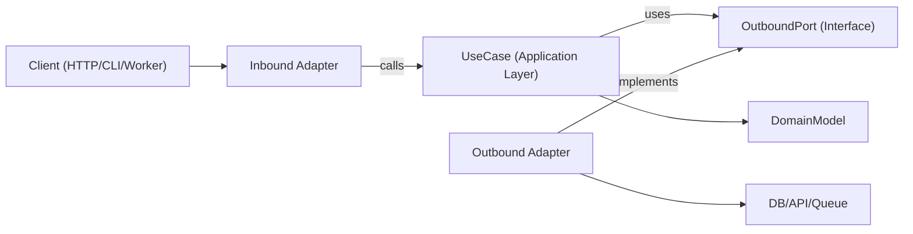

# 中核概念と実装ステップ

## 中核概念

- **ドメインモデル**: ビジネスルールとエンティティ／値オブジェクト。フレームワークのインポートは含まない。
- **ユースケース（アプリケーション層）**: ドメインの振る舞いとワークフローのステップを調整する。
- **インバウンドポート**: アプリケーションが何をできるかを記述する契約（コマンド／クエリ／ユースケースのインターフェース）。
- **アウトバウンドポート**: アプリケーションが必要とする依存関係の契約（リポジトリ、ゲートウェイ、イベントパブリッシャー、clock、UUID 等）。
- **アダプター**: ポートのインフラ実装と配信実装（HTTP コントローラー、DB リポジトリ、queue consumer、SDK ラッパー）。
- **コンポジションルート**: 具体的なアダプターをユースケースにバインドする単一の配線場所。

アウトバウンドポートのインターフェースは通常アプリケーション層に置き（抽象が真にドメインレベルである場合のみドメインに置き）、インフラアダプターがそれらを実装する。

## 依存方向は常に内向き

- アダプター → アプリケーション／ドメイン
- アプリケーション → ポートインターフェース（インバウンド／アウトバウンドの契約）
- ドメイン → ドメイン専用の抽象（フレームワークやインフラへの依存なし）
- ドメイン → 外部に依存しない

## アーキテクチャ図

## 実装ステップ

### Step 1: ユースケース境界をモデル化する

明確な入出力 DTO を持つ単一ユースケースを定義する。トランスポート詳細（Express の `req`、GraphQL の `context`、ジョブペイロードのラッパー）はこの境界の外に置く。

### Step 2: アウトバウンドポートを最初に定義する

副作用をすべてポートとして特定する:

- 永続化（`UserRepositoryPort`）
- 外部呼び出し（`BillingGatewayPort`）
- クロスカッティング（`LoggerPort`、`ClockPort`）

ポートは技術ではなく能力をモデル化する。

### Step 3: 純粋な調整としてユースケースを実装する

ユースケースのクラス／関数は、コンストラクタ／引数経由でポートを受け取る。アプリケーションレベルの不変条件を検証し、ドメインルールを調整し、プレーンなデータ構造を返す。

### Step 4: 端でアダプターを構築する

- インバウンドアダプターはプロトコル入力をユースケース入力に変換する。
- アウトバウンドアダプターはアプリの契約を具体的な API／ORM／クエリビルダーにマッピングする。
- マッピングはユースケース内ではなくアダプター内に留める。

### Step 5: コンポジションルートですべてを配線する

アダプターをインスタンス化し、それらをユースケースに注入する。隠れたサービスロケーターの振る舞いを避けるため、この配線は中央集約する。

### Step 6: 境界ごとにテストする

- フェイクポートを使ったユースケースのユニットテスト。
- 実際のインフラ依存と統合するアダプターのインテグレーションテスト。
- インバウンドアダプター経由でユーザー向けフローをテストする E2E テスト。
