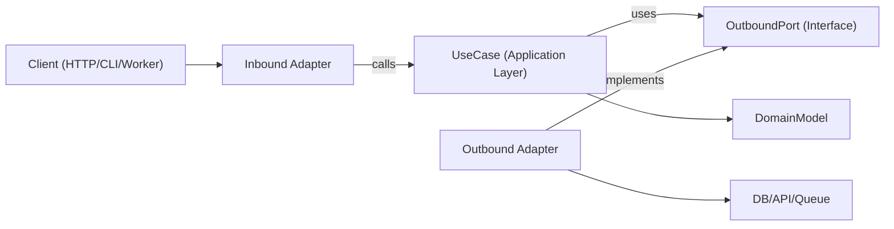

# ヘキサゴナルアーキテクチャ

ヘキサゴナルアーキテクチャ（Ports and Adapters）は、ビジネスロジックをフレームワーク、トランスポート、永続化の詳細から独立させる。コアアプリは抽象的なポートに依存し、アダプターが端でそれらのポートを実装する。

## 起動タイミング

- 長期的な保守性とテスト容易性が重要な新機能を構築するとき。
- ドメインロジックがI/O関心事と混在しているレイヤード／フレームワーク重視のコードをリファクタリングするとき。
- 同じユースケースに対して複数のインターフェース（HTTP、CLI、queue worker、cron job）をサポートするとき。
- ビジネスルールを書き換えずにインフラ（データベース、外部API、メッセージバス）を置き換えるとき。

リクエストが境界、ドメイン中心の設計、密結合サービスのリファクタリング、特定ライブラリからのアプリケーションロジックの分離に関わる場合に、このスキルを使う。

## 中核概念

- **ドメインモデル**: ビジネスルールとエンティティ／値オブジェクト。フレームワークのインポートは含まない。
- **ユースケース（アプリケーション層）**: ドメインの振る舞いとワークフローのステップを調整する。
- **インバウンドポート**: アプリケーションが何をできるかを記述する契約（コマンド／クエリ／ユースケースのインターフェース）。
- **アウトバウンドポート**: アプリケーションが必要とする依存関係の契約（リポジトリ、ゲートウェイ、イベントパブリッシャー、clock、UUID 等）。
- **アダプター**: ポートのインフラ実装と配信実装（HTTPコントローラー、DBリポジトリ、queue consumer、SDK ラッパー）。
- **コンポジションルート**: 具体的なアダプターをユースケースにバインドする単一の配線場所。

アウトバウンドポートのインターフェースは通常アプリケーション層に置き（抽象が真にドメインレベルである場合のみドメインに置き）、インフラアダプターがそれらを実装する。

依存方向は常に内向き:

- アダプター -> アプリケーション／ドメイン
- アプリケーション -> ポートインターフェース（インバウンド／アウトバウンドの契約）
- ドメイン -> ドメイン専用の抽象（フレームワークやインフラへの依存なし）
- ドメイン -> 外部に依存しない

## 仕組み

### Step 1: ユースケース境界をモデル化する

明確な入出力DTOを持つ単一ユースケースを定義する。トランスポート詳細（Express の `req`、GraphQL の `context`、ジョブペイロードのラッパー）はこの境界の外に置く。

### Step 2: アウトバウンドポートを最初に定義する

副作用をすべてポートとして特定する:

- 永続化（`UserRepositoryPort`）
- 外部呼び出し（`BillingGatewayPort`）
- クロスカッティング（`LoggerPort`、`ClockPort`）

ポートは技術ではなく能力をモデル化する。

### Step 3: 純粋な調整としてユースケースを実装する

ユースケースのクラス／関数は、コンストラクタ／引数経由でポートを受け取る。アプリケーションレベルの不変条件を検証し、ドメインルールを調整し、プレーンなデータ構造を返す。

### Step 4: 端でアダプターを構築する

- インバウンドアダプターはプロトコル入力をユースケース入力に変換する。
- アウトバウンドアダプターはアプリの契約を具体的なAPI／ORM／クエリビルダーにマッピングする。
- マッピングはユースケース内ではなくアダプター内に留める。

### Step 5: コンポジションルートですべてを配線する

アダプターをインスタンス化し、それらをユースケースに注入する。隠れたサービスロケーターの振る舞いを避けるため、この配線は中央集約する。

### Step 6: 境界ごとにテストする

- フェイクポートを使ったユースケースのユニットテスト。
- 実際のインフラ依存と統合するアダプターのインテグレーションテスト。
- インバウンドアダプター経由でユーザー向けフローをテストするE2Eテスト。

## アーキテクチャ図



## 推奨モジュール配置

明示的な境界を持つ、機能優先の構成を使う:

```text
src/
  features/
    orders/
      domain/
        Order.ts
        OrderPolicy.ts
      application/
        ports/
          inbound/
            CreateOrder.ts
          outbound/
            OrderRepositoryPort.ts
            PaymentGatewayPort.ts
        use-cases/
          CreateOrderUseCase.ts
      adapters/
        inbound/
          http/
            createOrderRoute.ts
        outbound/
          postgres/
            PostgresOrderRepository.ts
          stripe/
            StripePaymentGateway.ts
      composition/
        ordersContainer.ts
```

## TypeScript 例

### ポート定義

```typescript
export interface OrderRepositoryPort {
  save(order: Order): Promise<void>;
  findById(orderId: string): Promise<Order | null>;
}

export interface PaymentGatewayPort {
  authorize(input: { orderId: string; amountCents: number }): Promise<{ authorizationId: string }>;
}
```

### ユースケース

```typescript
type CreateOrderInput = {
  orderId: string;
  amountCents: number;
};

type CreateOrderOutput = {
  orderId: string;
  authorizationId: string;
};

export class CreateOrderUseCase {
  constructor(
    private readonly orderRepository: OrderRepositoryPort,
    private readonly paymentGateway: PaymentGatewayPort
  ) {}

  async execute(input: CreateOrderInput): Promise<CreateOrderOutput> {
    const order = Order.create({ id: input.orderId, amountCents: input.amountCents });

    const auth = await this.paymentGateway.authorize({
      orderId: order.id,
      amountCents: order.amountCents,
    });

    // markAuthorized returns a new Order instance; it does not mutate in place.
    const authorizedOrder = order.markAuthorized(auth.authorizationId);
    await this.orderRepository.save(authorizedOrder);

    return {
      orderId: order.id,
      authorizationId: auth.authorizationId,
    };
  }
}
```

### アウトバウンドアダプター

```typescript
export class PostgresOrderRepository implements OrderRepositoryPort {
  constructor(private readonly db: SqlClient) {}

  async save(order: Order): Promise<void> {
    await this.db.query(
      "insert into orders (id, amount_cents, status, authorization_id) values ($1, $2, $3, $4)",
      [order.id, order.amountCents, order.status, order.authorizationId]
    );
  }

  async findById(orderId: string): Promise<Order | null> {
    const row = await this.db.oneOrNone("select * from orders where id = $1", [orderId]);
    return row ? Order.rehydrate(row) : null;
  }
}
```

### コンポジションルート

```typescript
export const buildCreateOrderUseCase = (deps: { db: SqlClient; stripe: StripeClient }) => {
  const orderRepository = new PostgresOrderRepository(deps.db);
  const paymentGateway = new StripePaymentGateway(deps.stripe);

  return new CreateOrderUseCase(orderRepository, paymentGateway);
};
```

## 多言語マッピング

エコシステムを横断して同じ境界ルールを使う。変わるのは構文と配線スタイルのみ。

- **TypeScript/JavaScript**
  - ポート: `application/ports/*` をインターフェース／型として配置。
  - ユースケース: コンストラクタ／引数注入のクラス／関数。
  - アダプター: `adapters/inbound/*`、`adapters/outbound/*`。
  - コンポジション: 明示的な factory／container モジュール（隠れたグローバルなし）。
- **Java**
  - パッケージ: `domain`、`application.port.in`、`application.port.out`、`application.usecase`、`adapter.in`、`adapter.out`。
  - ポート: `application.port.*` のインターフェース。
  - ユースケース: 普通のクラス（Spring の `@Service` は任意、必須ではない）。
  - コンポジション: Spring config または手動配線クラス。配線をドメイン／ユースケースクラスから外す。
- **Kotlin**
  - モジュール／パッケージは Java の分割を踏襲（`domain`、`application.port`、`application.usecase`、`adapter`）。
  - ポート: Kotlin インターフェース。
  - ユースケース: コンストラクタ注入のクラス（Koin/Dagger/Spring/手動）。
  - コンポジション: モジュール定義または専用のコンポジション関数。サービスロケーターパターンを避ける。
- **Go**
  - パッケージ: `internal/<feature>/domain`、`application`、`ports`、`adapters/inbound`、`adapters/outbound`。
  - ポート: 消費するアプリケーションパッケージが所有する小さなインターフェース。
  - ユースケース: インターフェースフィールドを持つ struct と明示的な `New...` コンストラクタ。
  - コンポジション: `cmd/<app>/main.go`（または専用の配線パッケージ）で wire する。コンストラクタを明示的に保つ。

## 避けるべきアンチパターン

- ドメインエンティティが ORM モデル、Webフレームワーク型、SDK クライアントをインポートする。
- ユースケースが `req`、`res`、queue メタデータから直接読み取る。
- ドメイン／アプリケーションマッピングなしにユースケースからDB行を直接返す。
- アダプター同士がユースケースのポートを通さず直接呼び合う。
- 依存配線が多くのファイルに散らばり、隠れたグローバルシングルトンになる。

## 移行プレイブック

1. 変更が頻発する単一エンドポイント／ジョブの垂直スライスを1つ選ぶ。
2. 明示的な入出力型を持つユースケース境界を抽出する。
3. 既存のインフラ呼び出し周りにアウトバウンドポートを導入する。
4. 調整ロジックをコントローラー／サービスからユースケースに移動する。
5. 古いアダプターは残しつつ、新しいユースケースに委譲させる。
6. 新しい境界周りにテストを追加する（ユニット+アダプター統合）。
7. スライス単位で繰り返す。フル書き直しを避ける。

### 既存システムのリファクタリング

- **Strangler アプローチ**: 現行のエンドポイントを残し、ユースケースを1つずつ新ポート／アダプター経由にルーティングする。
- **ビッグバン書き直しなし**: 機能スライス単位で移行し、特性化テストで挙動を保つ。
- **ファサードを最初に**: 内部を置き換える前にレガシーサービスをアウトバウンドポートでラップする。
- **コンポジション凍結**: 新しい依存関係がドメイン／ユースケース層に漏れないよう、配線を早期に中央集約する。
- **スライス選定ルール**: 変更頻度が高くブラスト半径が小さいフローを優先する。
- **ロールバック経路**: 移行したスライスごとに、本番挙動が検証されるまで可逆なトグルやルートスイッチを残す。

## テスト指針（同じヘキサゴナル境界）

- **ドメインテスト**: エンティティ／値オブジェクトを純粋なビジネスルールとしてテストする（モックなし、フレームワークセットアップなし）。
- **ユースケースのユニットテスト**: アウトバウンドポートのフェイク／スタブで調整をテストする。ビジネス成果とポート相互作用をアサートする。
- **アウトバウンドアダプターの契約テスト**: ポートレベルで共有契約スイートを定義し、各アダプター実装に対して実行する。
- **インバウンドアダプターテスト**: プロトコルマッピングを検証する（HTTP/CLI/queue ペイロードからユースケース入力へ、出力／エラーをプロトコルに戻す）。
- **アダプターの統合テスト**: 実インフラ（DB/API/queue）に対して、シリアライズ、スキーマ／クエリの挙動、リトライ、タイムアウトを実行する。
- **エンドツーエンドテスト**: インバウンドアダプター -> ユースケース -> アウトバウンドアダプターを通る重要なユーザージャーニーをカバーする。
- **リファクタリングの安全性**: 抽出前に特性化テストを追加し、新境界の挙動が安定し等価であると確認できるまで保持する。

## ベストプラクティスチェックリスト

- ドメイン層とユースケース層は内部型とポートのみインポートする。
- 外部依存はすべてアウトバウンドポートで表現される。
- バリデーションは境界（インバウンドアダプター+ユースケースの不変条件）で行う。
- イミュータブルな変換を使う（共有状態を変更せず、新しい値／エンティティを返す）。
- エラーは境界を越えて翻訳される（インフラエラー -> アプリケーション／ドメインエラー）。
- コンポジションルートは明示的で監査しやすい。
- ユースケースはポートのシンプルなインメモリフェイクでテスト可能である。
- リファクタリングは挙動を保つテストとともに、1つの垂直スライスから始める。
- 言語／フレームワーク固有事項はアダプターに留め、ドメインルールには持ち込まない。
